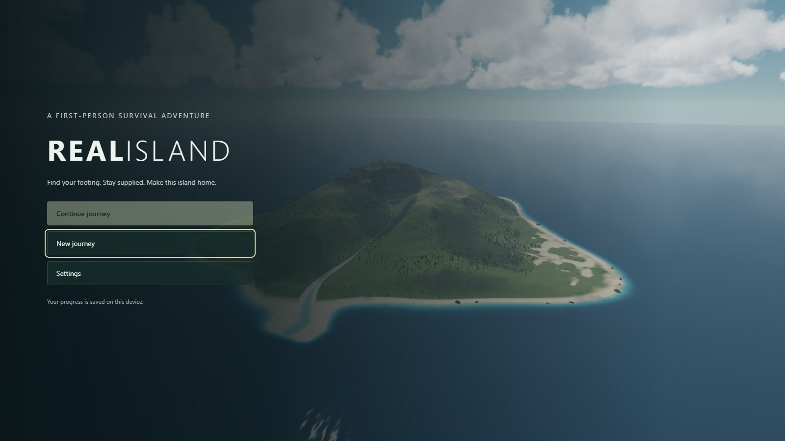
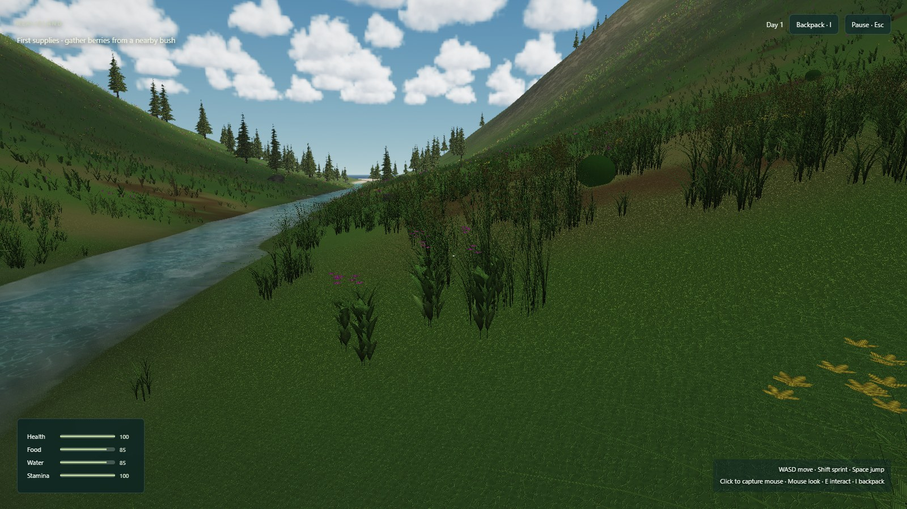
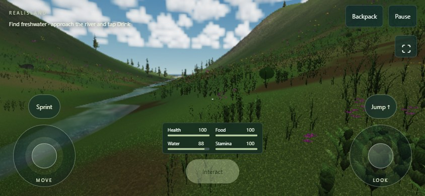
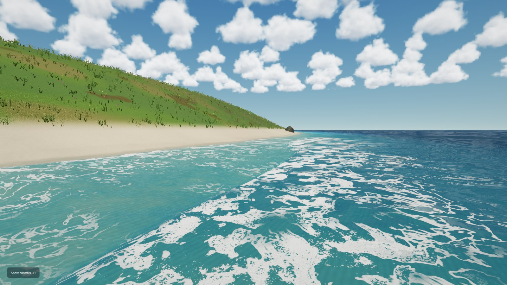

# RealIsland

[](https://github.com/SamG-Coder/RealIsland/actions/workflows/pages.yml)
[](https://github.com/SamG-Coder/RealIsland/actions/workflows/validate.yml)

**[Play RealIsland](https://samg-coder.github.io/RealIsland/)** · [How to play](docs/how-to-play.md) · [Actions](https://github.com/SamG-Coder/RealIsland/actions)

A first-person survival prototype: explore, gather berries, find freshwater,
and keep yourself supplied. Grass bends around your legs and moving through
water disturbs the live simulation.



| Explore on foot | Play with two-thumb controls |
| --- | --- |
|  |  |
| Desktop, High quality | Touch layout, Low quality |



**Ocean and coastal simulation based on
[coastal-simulation by iamtechartist (Techartist)](https://github.com/iamtechartist/coastal-simulation)**,
integrated through [SamG-Coder’s CUDA WebShader port](https://github.com/SamG-Coder/coastal-simulation-cuda-webshader).
The original provides the coastal simulation, shallow-water equations, materials
and procedural scene assets.
[See the original demo](https://iamtechartist.github.io/coastal-simulation/).
Original MIT copyright and licence notices are retained.


*Actual captures from the running game. The mobile image uses an emulated phone
viewport on desktop hardware; it does not demonstrate physical-phone frame rates.*

A connected procedural island using **RealGrass, MountainRIver and Saltreach**.
Their pinned original repositories remain in `vendor/`.

Roughly two kilometres of island sit within a 3.2 km simulation domain. A downhill
river flows between upland ridges and joins the same water grid as the sea.
Grass, rocks, trees and shoreline wetness use the shared terrain. See the
[researched design](docs/island-design.md) for references, dimensions and limits.

## Mobile

Open the [HTTPS game link](https://samg-coder.github.io/RealIsland/) on a device
with a WebGPU-capable browser. Play **landscape**: the left analog stick moves,
the right looks around. Partial stick travel walks slowly; hold **Sprint** to
run. **Jump**, **Gather / Drink**, **Backpack**, and **Pause** have touch buttons.

Sprint sits beside Jump above the right stick. Touch gameplay targets 30 FPS.
The Low preset uses a smaller nearby water tile, fewer plants and cheaper clouds.

New touch sessions default to Low quality and adaptive resolution. Controls
respect screen cutouts and reset on interruption. Portrait mode pauses gameplay.
Tap **⛶** or **Enter landscape** to request fullscreen and landscape orientation;
browsers that cannot lock orientation provide a manual rotation prompt.

## Menus and actions

| Screen | Actions |
| --- | --- |
| Title | New journey, Continue, Settings |
| Pause | Resume, Save, Settings, Save & return to title |
| Backpack | View gathered berries and eat to restore food |
| Settings | Quality, adaptive resolution, sensitivity, mobile fullscreen |
| Recovery | Return to the starting area after health runs out |
| Portrait prompt | Pause safely while turning the phone landscape |

[Full controls, saving, and the survival loop →](docs/how-to-play.md)

## Run

Use Node.js 22+ and Edge or Chrome with hardware WebGPU enabled.

```sh
git clone --recurse-submodules https://github.com/SamG-Coder/RealIsland.git
cd RealIsland
npm start
```

Startup compiles the actual CUDA sources to WGSL, then serves localhost:5173.
No native CUDA toolkit or npm dependencies are required. For an existing clone,
run `git submodule update --init --recursive` first. Windows also has `start.bat`.

If that port is occupied, use PowerShell:

```powershell
$env:PORT = '5180'
npm start
```

Open http://localhost:5180/?quality=high&seed=1741 for High quality.

## Survival prototype

The default page opens the first-person survival title menu. Start a new journey
or continue the local save. WASD/arrows move, Shift sprints, Space jumps, and
clicking the scene captures the mouse for looking around. Escape releases the
mouse and pauses; I opens the backpack; E gathers berries or drinks freshwater.
Hold and drag to look if mouse capture is unavailable.

Progress autosaves every 30 seconds of play and when leaving the page. Pause also
offers Save and Save & return to title. Saves are stored in this browser on this
device; clearing site data removes them. Food, water, stamina, health, inventory,
position, island seed and harvested bush cooldowns persist. Starting a new journey
asks before replacing an existing save.

For the original scenery and simulation controls, open `?mode=explore`.
There, drag to look, WASD/arrows fly, Q/E change height, Shift increases speed,
1–6 select views, H hides the interface and P pauses water.

See [the survival foundation](docs/survival-foundation.md) for implementation
limits and validation.

## GitHub Pages and Actions

The [Pages workflow](.github/workflows/pages.yml) runs on pushes to `main` or
manual dispatch. It checks out pinned submodules, runs tests, compiles the CUDA
kernels, builds the self-contained site and deploys `dist/` to GitHub Pages.
The separate [validation workflow](.github/workflows/validate.yml) runs browser
WebGPU checks and retains build reports.

## Build and validate

```sh
npm test
npm run build
```

The self-contained static build is in `dist/`, with no CDN dependencies. Unit tests
regenerate kernel artifacts automatically. With the server running, hardware
validation on Windows uses:

```powershell
python -m pip install playwright==1.56.0
$env:TEST_GPU = 'hardware'
$env:TEST_QUALITY = 'high'
$env:TEST_URL = 'http://127.0.0.1:5180/'
npm run test:gpu
```

The default test uses Playwright Chromium/SwiftShader for CI; install that browser
with `python -m playwright install chromium`. Reports/screenshots go to `reports/`.
Hardware results verify correctness, not performance on every device. Package a
flattened source archive using `python scripts/package.py`.

The scenery is procedural and the water is a shallow-water simulation. This is
not a claim of photorealism or simulated erosion. See [credits](CREDITS.md) and
[design limitations](docs/island-design.md).

Water detail follows the camera throughout the island at 0.3 m spacing.
Low uses a 76.8 × 76.8 m tile to reduce mobile GPU work.
On Balanced/High/Ultra, the moving 153.6 × 120 m grid scrolls in whole cells, preserving overlapping
water, foam, wetness and flow exactly. New cells inherit live island water and
resolve local rock collisions; moving or changing views does not reset the clock.
The island grid continues simulating outside the detail region. The two grids
exchange state; this is not a globally conservative adaptive-mesh solver.

Coastal rendering uses Saltreach's original GPU-generated RGBA noise, foam
channels, short-wave detail, water colours, crest lighting and impact spray model.
Coastal rocks use its stone shape, adapted to shared island descriptors.
Reflection contribution stays reduced (0.12) as requested.

Run `python scripts/test-dynamic-water.py` with the source server on port 5180
for overlap preservation, camera travel, impact/dry-bed tests and a moving clip.
The report and captures are written to `reports/dynamic-water/`.

## Licence

RealIsland’s original code is licensed under the [MIT License](LICENSE).
Third-party code and assets retain their respective licences and copyright
notices; see [sources and attribution](CREDITS.md).
