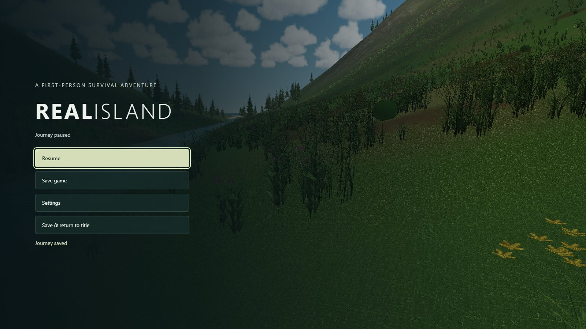

# Playing RealIsland

[Play in your browser](https://samg-coder.github.io/RealIsland/) · [README](../README.md)

## Your first journey

Choose **New journey**, walk to a nearby berry bush, and gather. Open the
backpack and eat a berry. Approach the river until **Drink freshwater** appears,
then interact. Explore while keeping food and water supplied. Sprinting costs
stamina, and steep falls hurt. Grass parts near your legs; moving through water
creates local ripples and a wake.

## Controls

| Action | Keyboard / mouse | Touch |
| --- | --- | --- |
| Move | WASD or arrows | Left analog stick |
| Look | Click scene, then move mouse; drag fallback | Right analog stick |
| Sprint | Hold Shift while moving | Hold Sprint while using left stick |
| Jump | Space | Jump button |
| Gather / drink | E when prompted | Gather / Drink button |
| Eat | I, then Eat one | Backpack, then Eat one |
| Pause | Escape | Pause |
| Fullscreen / landscape | Browser fullscreen | ⛶ or Settings → Fullscreen · landscape |

Sprint and Jump sit together above the right stick, leaving your left thumb free
to keep moving. Touch gameplay targets 30 FPS (menus 15 FPS) to limit sustained
GPU and battery load.

Both sticks work simultaneously. Release them to stop moving/turning. A small
dead zone prevents accidental movement, and partial stick travel gives slower
movement. Menus and interrupted touches clear held controls.

## Mobile orientation and quality

Play landscape. Portrait displays a rotation prompt and pauses the world.
Turning back resumes with neutral controls. Fullscreen and orientation locking
are requested after tapping the relevant button; availability depends on the
browser. If locking is unavailable, turn the phone manually and enable device
screen rotation.

New touch sessions start at Low quality with adaptive resolution. A saved
graphics preference or explicit URL quality overrides that default. WebGPU and
HTTPS are required (localhost also works for development). Touch behavior is
tested with browser emulation; physical-device performance is not yet measured.

## Saving

Autosave runs every 30 seconds of active play and on page departure. Pause also
offers Save and Save & return to title. Continue restores position, needs,
inventory, harvested resources and island seed.

One save lives in this browser's storage for this site. Localhost and GitHub
Pages have separate saves. Clearing site data removes it. New journey asks
before replacing a save. There is no cloud sync or multi-slot system.

## Current scope

Title, pause, settings, backpack, recovery and rotation screens are playable.
The current survival loop covers berries, freshwater, needs and exploration.
Crafting, shelter, combat, footstep audio and splash particles remain future
work. See [implementation details](survival-foundation.md).
